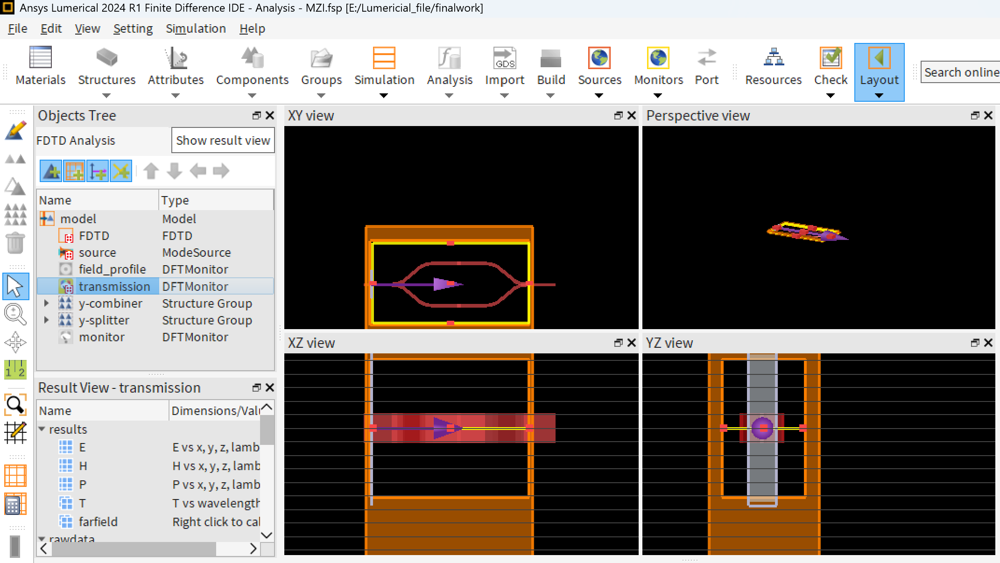
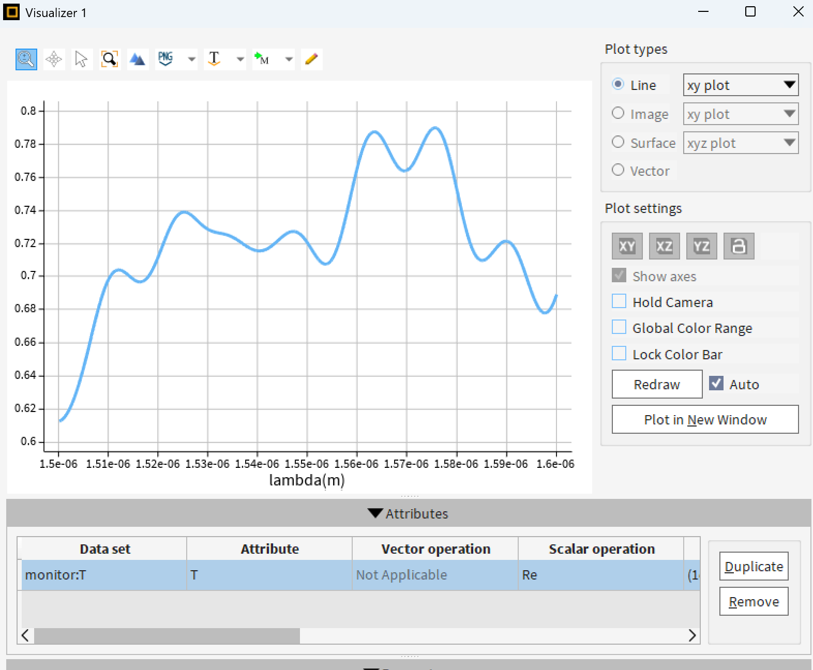
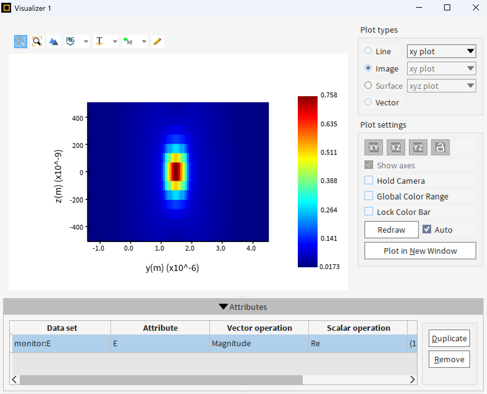
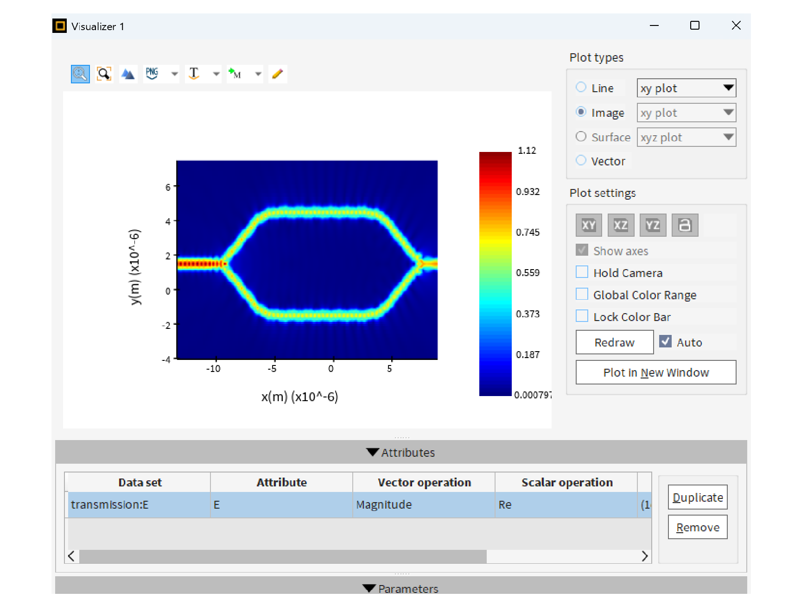

# 基于 Lumerical FDTD 的硅光 MZI（Mach-Zehnder Interferometer）器件仿真

## 1. 项目背景

Mach-Zehnder Interferometer（MZI，马赫-曾德干涉仪）是硅光集成电路中最基础、最重要的器件之一，广泛应用于：

- 光调制器（Optical Modulator）
- 光开关（Optical Switch）
- 功率分束与合束（Splitter / Combiner）
- 光传感（Optical Sensing）

MZI 的核心原理是利用两条光路之间的相位差产生干涉，从而调控输出光强。

本项目基于 **Ansys Lumerical FDTD 2024 R1**，设计并仿真了一个基于：

- Y-Splitter
- 双臂干涉结构
- Y-Combiner

的硅光 MZI 器件，并对其：

- 光场分布
- 波导模式
- 传输谱特性

进行了分析。

---

# 2. 器件结构设计

整体器件由以下部分组成：

- 输入波导
- Y 型分束器（Y-splitter）
- 双干涉臂
- Y 型合束器（Y-combiner）
- 输出波导


# 3. MZI 结构示意图





---

# 4. 仿真参数设置

## 4.1 材料参数

| 参数 | 数值 |
|---|---|
| 波导材料 | Silicon (Si) |
| 平台 | SOI (Silicon-on-Insulator) |

---

## 4.2 几何参数

### Y-Splitter / Y-Combiner 参数

| 参数 | 数值 | 单位 |
|---|---|---|
| base angle | 90 | deg |
| base width | 0.5 | μm |
| base height | 0.22 | μm |
| Lw | 4 | μm |
| Ls | 6 | μm |
| y span | 6 | μm |


---

## 4.3 FDTD 仿真设置

| 参数 | 设置 |
|---|---|
| Solver | FDTD |
| Source | Mode Source |
| 波长范围 | 1.50 μm ~ 1.60 μm |

---

## 4.4 Monitor 设置

仿真中使用了多个 DFT Monitor：

| Monitor | 功能 |
|---|---|
| field_profile | 光场分布 |
| transmission | 透射谱 |
| monitor | 输出监视 |

记录数据包括：

- Electric Field (E)
- Transmission (T)

---

# 5. 仿真结果

## 5.1 Transmission Spectrum（透射谱）

仿真得到 transmission vs wavelength 曲线如下：



---

### 结果分析

可以观察到：

- Transmission 随波长呈现明显周期性振荡
- 峰值 transmission 约为：

```math
T \approx 0.80
```

这种振荡来自于：

- 两条干涉臂之间的相位差变化
- 不同波长对应不同干涉状态

---

## 5.2 光场分布（Field Distribution）



---

### 分析

- 光场主要集中在硅波导核心区域
- 模场呈现典型 TE-like 分布
- 能量约束良好
- 辐射损耗较低

该波导结构具有较好的导模性能。

---

## 5.3 电场传播分布（Electric Field Propagation）

MZI 中的电场传播情况如下图所示：



### 分析

从图中可以观察到：

- 输入光在 Y-splitter 处分成两路
- 两条干涉臂中的电场分布较均匀
- 波导弯曲区域存在少量辐射损耗
- 在 Y-combiner 处重新合束形成干涉

此外：

- 光场主要限制在硅波导内部
- 模式传播稳定
- 能量泄露较小

说明当前波导结构具有较好的导波能力。

该结果验证了：

- MZI 的干涉工作原理
- Y-splitter / combiner 的分束与合束功能
- 硅波导对 TE 模式的良好约束特性

# 6. MZI 干涉原理分析

MZI 输出传输满足：

```math
T \propto \cos^2\left(\frac{\Delta \phi}{2}\right)
```

其中：

```math
\Delta \phi = \frac{2\pi}{\lambda}\Delta L n_{eff}
```

参数说明：

| 参数 | 含义 |
|---|---|
| \(\Delta \phi\) | 相位差 |
| \(\Delta L\) | 光程差 |
| \(n_{eff}\) | 有效折射率 |

随着波长变化：

- 相位差发生变化
- 输出干涉状态改变
- 从而形成 transmission oscillation

---

# 7. 结果讨论

## 优点

- 结构简单
- 易于硅光集成
- 模场稳定
- 干涉现象明显

---

## 存在的问题

Transmission 未达到理论最大值，可能原因包括：

- Y-splitter 分光不完全均匀
- 模式失配
- 波导弯曲损耗
- 数值网格误差

---

# 8. 可优化方向

## 结构优化

- ### 使用 MMI 替代 Y-splitter 在实际的工业生产当中非常难实现上述的结构，因此大部分的MZI是采用两个MMI的结构组成。我们会在下次完成。本次的仿真基于一种非常理想的情况，也降低了很多的光衍射带来的能量损失。

---

# 9. 项目总结

本项目基于 Lumerical FDTD 完成了：

- 硅光 MZI 结构建模
- 光场传播仿真
- 干涉谱分析

验证了：

- MZI 干涉机制
- 波导中的模式传播特性

该项目展示了：

- 硅光器件设计能力
- 光子器件仿真能力
- FDTD 建模能力
- 集成光学基础理论理解

适用于：

- 硅光芯片方向实习申请
- 光通信方向研究
- PIC（Photonic Integrated Circuit）相关项目展示

---


# 项目关键词

```
Silicon Photonics
Lumerical
FDTD
MZI
Mach-Zehnder Interferometer
Waveguide
Integrated Photonics
Optical Simulation
```
